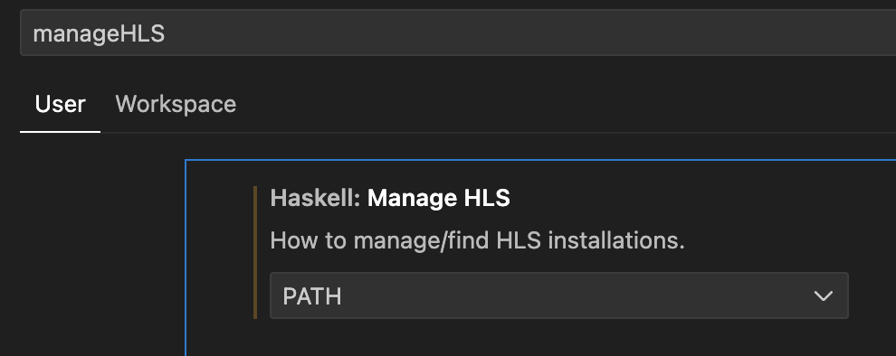

# arvo


## Setting up the development environment

This document assumes a Windows 11 laptop with a minimum of 16GB RAM (32GB preferred). With minor modifications to
the installation instructions, it is possible to set up a usable environment on a Linux or a MacOS machine as well
(basically, ignore everything to do with WSL).

### Installation overview

1. Install prerequisites: WSL, Ubuntu, devbox (this last will handle additional dependencies automatically)
2. Check out the starter source code from the git repository
3. Run the build and IDE to verify the installation

There are also a few optional steps that will improve development experience, but require additional configuration 
or referring to external documentation.


### Install prerequisites

- Install wsl (see: https://learn.microsoft.com/en-us/windows/wsl/install), but TL;DR version is basically, from
  Windows terminal/shell or command prompt, run:
  ```bash
  wsl --install -d Ubuntu-24.04
  ```
  
  > Note: Default is 'Ubuntu', but a more recent LTS version is recommended (tested with 24.04)

- (Optional) Default memory allocated to WSL is probably sufficient, but if necessary, allocate more by adding
  a `.wslconfig` file in your Windows home directory. Restart WSL after changing; tweak as needed.
  ```
  [wsl2]
  memory=16GB
  ```
  
- Install devbox (see: https://www.jetify.com/devbox/docs/installing_devbox/), but TL;DR version is:
  ```bash
  curl -fsSL https://get.jetify.com/devbox | bash
  ```
 
- (Optional) Install direnv - see [Appendix A](#appendix-a-using-direnv).

- Check out the source:
  ```bash
  git clone ...
  cd arvo
  ```

- If direnv is installed, on entry to the project directory you may get a message. Allow direnv to run the `.envrc` file.
  > direnv: error /.../.envrc is blocked. Run `direnv allow` to approve its content
  ```bash
  direnv allow
  ```

- If not using direnv, start the devbox shell now (not needed if direnv is installed and allowed for the project directory):
  ```bash
  devbox shell
  ```

- Verify the installation (should compile and run without errors):
  ```bash
  stack run
  stack test
  ```

### Start the IDE

Development environment includes a default installation of VSCodium (the open source variant of VSCode), with the
required extensions pre-installed. Start it from the source code root, like this:

```bash
devbox run ide
```

Select Yes when asked: "Do you trust the authors of the files in this folder?"

When opening a Haskell source file for the first time in VSCode, a popup may be shown to select the method by which
Haskell environment will be set up (language server, compiler, build tools, etc). Select 'Manually via PATH'. Even
though it says 'manually', the path is already set up by devbox, and no further configuration should be needed.


Alternatively, go to settings (`Ctrl-,`), change to JSON view (or find the `manageHLS` option and set it to `PATH`)
```json
{
    "haskell.manageHLS": "PATH"
}
```




## Appendix A: Using direnv

Optional, but recommended. Using direnv will start the devbox shell automatically, on entry to the source
directory (or any of the subdirectories). It will also revert the environment on exit (when changing directory to
something outside the source tree).

- Install direnv
  ```bash
  sudo apt install direnv
  ```

- Set up the direnv hook for your shell: https://direnv.net/docs/hook.html. For bash, add the following line to the
  `~/.bashrc` file, then restart the shell/terminal:
  ```bash
  eval "$(direnv hook bash)"
  ```

- From the source directory, if direnv configuration file `.envrc` does not already exist, generate one to start the
  devbox shell automatically on entry to the directory. Running the shell for the first time will take a while since
  the packages and their dependencies need to be installed and configured at this time.
  ```bash
  devbox generate direnv
  ```

- First time you enter the source directory with a `.envrc` file you will need to allow direnv to use it:
  ```bash
  direnv allow
  ```

- (Optional) To make direnv a bit less verbose when entering a directory, add the `hide_env_diff` option to the direnv
  configuration file `~/.config/direnv/direnv.toml` (create the directory and file if it doesn't already exist).
  Requires direnv version >= 2.34.0 (may need to install it from https://direnv.net as Ubuntu seems to package an older
  version)
  ```toml
  [global]
  hide_env_diff = true
  ```

- (Optional) Older versions of direnv do not support the `hide_env_diff` option, but it's possible to make the verbose
output appear dimmer and less intrusive by setting this environment property in `~/.bashrc`:
  ```bash
  export DIRENV_LOG_FORMAT=$'\033[2mdirenv: %s\033[0m'
  ```


<!-- vim: set tw=120: -->
